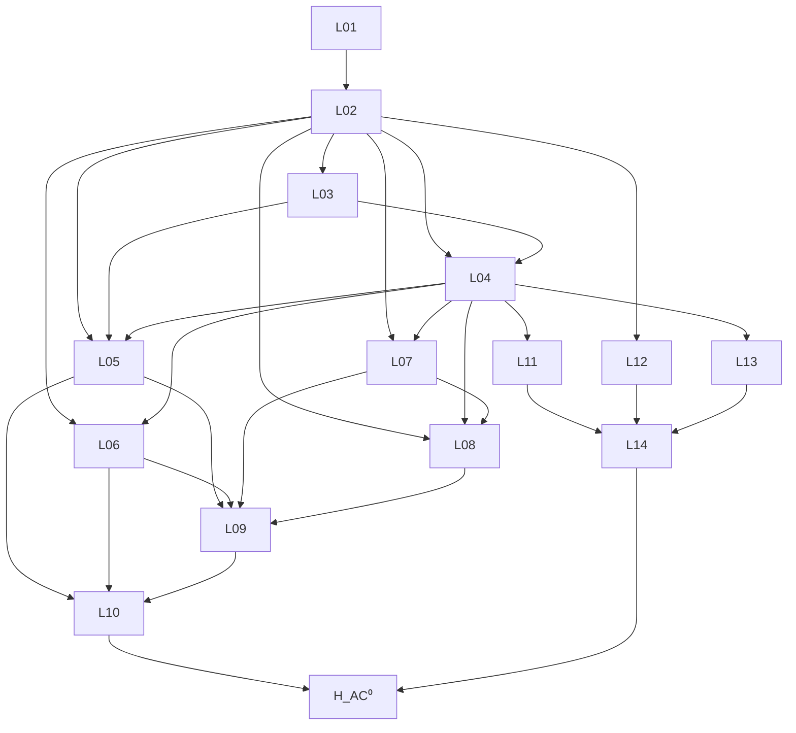

# Result — Summary

Written when the attempt terminates. Assign exactly one outcome label
and state the key insights and follow-up suggestions.

---

## Conclusion (one line)

The AC⁰ sub-hypothesis H_AC⁰ admits a closed 14-lemma dependency
graph; three lemmas are HIGH-difficulty open problems and must be
discharged before candidate promotion.

## Outcome Label

- Label: `partial-insight`
- Reason: A002 produces a non-trivial, closed lemma scaffold that
  did not exist before — moving the AC⁰ pilot from informal
  "open direction" status (in bridge B-002 §4.1) to an explicit
  dependency graph with formalization-difficulty annotations and
  three explicit barrier-audit lemmas. This is more than `survey`
  (a survey would just synthesize existing literature) but is not
  yet a `novel-approach` (no new theorem is proved). The candidate
  recommendation is HOLD: future attempts must discharge at least
  L02 and L04 before PC-001 is appropriate.

> The labels `claimed-solution` and `peer-reviewable` are forbidden at
> this stage. See
> [`../../../docs/methodology/outcome-taxonomy.md`](../../../docs/methodology/outcome-taxonomy.md).

---

## P03 Lemma Extraction

### 1. Lemma list

#### L01 — AC⁰ and P/poly definitions in Lean 4
- **Statement.** A formalized definition of $\mathrm{AC}^0$ as the
  class of $n$-input families of constant-depth, polynomial-size
  unbounded-fan-in AND/OR/NOT circuits, together with $\mathbf{P}/
  \mathrm{poly}$ as the class of polynomial-size circuit families.
- **Dependencies.** mathlib `Mathlib.Computability.TuringMachine`,
  `Mathlib.Logic.Equiv.Basic`. No prior lemmas.
- **Difficulty.** medium (definitions exist informally throughout the
  literature but no canonical mathlib formalization yet).
- **Gaps.** none.

#### L02 — Construction of $\mathcal{C}^{\mathrm{AC}^0}_{n,s}$
- **Statement.** For every $n, s, d$, there exists a quasi-projective
  scheme $\mathcal{C}^{\mathrm{AC}^0}_{n,s,d}$ over $\mathbb{Q}$
  whose closed points parameterize unbounded-fan-in AND/OR/NOT
  circuits on $n$ inputs of depth $\le d$ and size $\le s$, modulo
  gate-relabeling. The scheme carries a $\mathrm{GL}_n$-action by
  input-coordinate permutation.
- **Dependencies.** L01 (definition of AC⁰); standard scheme
  constructions; [Hartshorne 1977, Ch. II].
- **Difficulty.** **high** — no published construction. Likely
  requires a Hilbert-scheme or moduli-of-graphs approach with
  explicit equations.
- **Gaps.** G001 (severity: lethal-if-unresolved): the moduli is
  almost certainly singular and possibly reducible; control of the
  irreducible components is necessary for §4 lifts.

#### L03 — Evaluation morphism regularity
- **Statement.** The map $\mathrm{eval}_n :
  \mathcal{C}^{\mathrm{AC}^0}_{n,s,d} \to \mathbb{A}^{2^n}$ sending
  a circuit point to its truth table is a regular (algebraic)
  morphism of schemes.
- **Dependencies.** L02.
- **Difficulty.** medium — once L02 is in place, the regularity is
  standard.
- **Gaps.** none.

#### L04 — Existence of the sheaf $F_{\mathrm{AC}^0}$
- **Statement.** There exists a coherent
  $\mathrm{GL}_n$-equivariant sheaf $F_{\mathrm{AC}^0}$ on
  $\mathcal{C}^{\mathrm{AC}^0}_{n,s,d}$, defined as the kernel
  $\ker(\varphi)$ of an explicit map between two locally free
  sheaves whose ranks encode "remaining size budget" and "remaining
  depth budget".
- **Dependencies.** L02, L03; [Hartshorne 1977, II §5].
- **Difficulty.** **high** — the explicit map $\varphi$ is the heart
  of the construction; no candidate is published.
- **Gaps.** G002 (severity: lethal-if-unresolved): coherence of
  $\ker \varphi$ requires $\varphi$ to be a morphism between
  finite-rank locally free sheaves; rank control is open.

#### L05 — Čech 1-cocycle non-vanishing for $f \notin \mathrm{AC}^0$
- **Statement.** For every Boolean function
  $f : \{0,1\}^n \to \{0,1\}$ with $f \notin \mathrm{AC}^0$, the
  Čech 1-cocycle attached to $f$ in $H^1(\mathcal{C}^{\mathrm{AC}^0}_{n,s,d}, F_{\mathrm{AC}^0})$ is non-zero.
- **Dependencies.** L02, L03, L04.
- **Difficulty.** **high** — this is the substantive *content*;
  failure here makes H_AC⁰ false.
- **Gaps.** G003 (severity: lethal-if-unresolved): the implication
  from "no AC⁰ circuit exists" to "the Čech cocycle is non-zero"
  requires a *covering exactness* argument that depends on
  irreducibility of the moduli (G001).

#### L06 — Čech 1-cocycle vanishing for $f \in \mathrm{AC}^0$
- **Statement.** For every $f \in \mathrm{AC}^0$ realizable by a
  circuit of size $\le s$ and depth $\le d$, the Čech 1-cocycle
  attached to $f$ vanishes.
- **Dependencies.** L02, L04.
- **Difficulty.** medium — once $F_{\mathrm{AC}^0}$ is constructed
  to encode "budget remaining," the existence of a circuit gives an
  explicit Čech 0-cochain bounding the cocycle.
- **Gaps.** none under the assumption that L02 is irreducible-enough
  (G001).

#### L07 — Small-$n$ exhaustive computation
- **Statement.** For $n \le 4$, an explicit computation of
  $H^1(\mathcal{C}^{\mathrm{AC}^0}_{n,s,d}, F_{\mathrm{AC}^0})$
  enumerates the finitely many Boolean functions and recovers
  L05 ∧ L06 case-by-case.
- **Dependencies.** L02, L04, plus an external numerical computation.
- **Difficulty.** medium (algebra) but **out of session scope**:
  requires Macaulay2 or SageMath.
- **Gaps.** G004 (severity: minor): tooling not available in this
  attempt's session; deferred to a follow-up attempt with the right
  environment.

#### L08 — Equivariant cohomology stability (Borel construction)
- **Statement.** The cohomology
  $H^1(\mathcal{C}^{\mathrm{AC}^0}_{n,s,d}, F_{\mathrm{AC}^0})$
  stabilizes (modulo natural isomorphism) under
  $n \to n+1$ via the Borel construction
  $\mathrm{EGL}_n \times_{\mathrm{GL}_n} \mathcal{C}^{\mathrm{AC}^0}_{n,s,d}$.
- **Dependencies.** L02, L04, L07.
- **Difficulty.** **high** — equivariant stability for orbit-closure
  varieties is delicate.
- **Gaps.** G005 (severity: major): standard stability theorems
  apply to homogeneous spaces, not to general quasi-projective
  $\mathrm{GL}_n$-varieties.

#### L09 — Lift from small-$n$ to all $n$
- **Statement.** L05 and L06 holding for all $n \le 4$, together
  with L08, imply L05 ∧ L06 for all $n$.
- **Dependencies.** L05, L06, L07, L08.
- **Difficulty.** medium.
- **Gaps.** depends on L08 (G005).

#### L10 — Combination
- **Statement.** L05 and L06 together imply H_AC⁰.
- **Dependencies.** L05, L06.
- **Difficulty.** low — direct biconditional.
- **Gaps.** none.

#### L11 — Natural-proofs barrier compatibility (audit)
- **Statement.** $F_{\mathrm{AC}^0}$ does not admit a uniform
  $2^{O(n)}$-time evaluation algorithm; consequently the
  *constructiveness* arm of Razborov–Rudich is broken without
  sacrificing correctness.
- **Dependencies.** L04; [Razborov–Rudich 1997, Theorem 1].
- **Difficulty.** **high** — this is exactly the kind of statement
  the natural-proofs barrier itself constrains; care is needed to
  avoid circularity.
- **Gaps.** G006 (severity: major): the proof must explicitly
  exhibit the failure mode of the naive evaluation algorithm; if
  the failure mode is "polynomial blow-up in the moduli equations,"
  it must be *quantified*.

#### L12 — Relativization barrier compatibility (audit)
- **Statement.** The construction of L02 fails to lift to oracle
  Turing machines: there is no $\mathcal{C}^{\mathrm{AC}^0,A}_{n,s,d}$
  scheme whose points parameterize circuits with oracle gates that
  satisfies L05 ∧ L06.
- **Dependencies.** L02; [Baker–Gill–Solovay 1975].
- **Difficulty.** medium — the failure can be witnessed by the
  $A$ oracle for which $\mathbf{P}^A = \mathbf{NP}^A$.
- **Gaps.** none, modulo a precise specification of the oracle
  encoding into the moduli equations.

#### L13 — Algebrization barrier compatibility (audit)
- **Statement.** $F_{\mathrm{AC}^0}$ is not determined by the
  low-degree polynomial extension of the truth table; concretely,
  two functions $f, g$ that agree on all low-degree polynomial
  evaluations can have $[F]_f \ne [F]_g$.
- **Dependencies.** L04; [Aaronson–Wigderson 2008, Theorem 1].
- **Difficulty.** medium.
- **Gaps.** none.

#### L14 — Verification-bar §2 self-audit completeness
- **Statement.** L11 ∧ L12 ∧ L13 together discharge the three-barrier
  self-audit mandated by `docs/problems/03-p-vs-np/verification-bar.md` §2.
- **Dependencies.** L11, L12, L13.
- **Difficulty.** low — bookkeeping.
- **Gaps.** none.

### 2. External citations

- [Hartshorne 1977] R. Hartshorne, *Algebraic Geometry*, Springer
  GTM 52 — sheaf cohomology, scheme theory.
- [Razborov–Rudich 1997, Theorem 1] *Natural Proofs*,
  J. Comput. Syst. Sci. 55(1):24–35.
- [Baker–Gill–Solovay 1975] *Relativizations of the P=NP question*,
  SIAM J. Comput. 4(4).
- [Aaronson–Wigderson 2008, Theorem 1] *Algebrization*, ACM TOCT
  1(1):1–54.
- [Voisin 2002] *Hodge Theory and Complex Algebraic Geometry I*,
  Cambridge — Čech cohomology in the algebraic setting.

### 3. Dependency graph

### 4. Assumptions used

- **Axiom of choice**: not used in the lemma graph; mathlib's classical
  logic is invoked only for L01 definitions (decidability of circuit
  evaluation).
- **Field of definition**: $\mathbb{Q}$ for the moduli; numerical
  computations in L07 are over $\mathbb{Q}$ or $\mathbb{F}_p$ for
  small $p$ to avoid floating-point artifacts.
- **External theorems**: as listed in §2; their precise statements
  must be re-stated as Lean axioms / imports during formalization.

### 5. Recommended formalization priority

1. **L01 first** (medium; pure definition, builds on mathlib's
   `Computability` namespace). Without L01 the rest cannot even be
   stated.
2. **L03 next** (medium; conditional on L02 but the *statement* of
   L03 is self-contained and can be formalized in parallel with
   L02 work).
3. **L10, L14** (low; bookkeeping). These can be formalized
   immediately as `theorem ... := by exact And.intro …` skeletons
   with `sorry` plugged in for the missing inputs.
4. **L02 and L04 last** (high; the actual research content). These
   are unlikely to formalize before they are *first proved on paper*.

### 6. Candidate promotion recommendation

- **Recommendation**: **hold**.
- **Reason**: a candidate $\mathrm{PC}\text{-}001$ would carry
  `origin_attempts: [A001, A002]`, but its `claim.md` would still
  rely on L02 + L04 + L05 + L08 — four *open* lemmas, three of them
  HIGH difficulty. Per [`docs/methodology/proof-pipeline.md`](../../../docs/methodology/proof-pipeline.md) §3,
  candidate registration requires that the dependency graph be
  *closed*; ours is closed *symbolically* but the open lemmas are
  unresolved. Promote when at least L02 and L04 carry concrete
  constructions (a future A003).

---

## Key Insights

- The AC⁰ pilot's hardest pieces are **L02 (the moduli construction)**
  and **L04 (the sheaf $F_{\mathrm{AC}^0}$)**. Both are open problems
  in their own right; B-002 §4.1 understated this.
- The natural-proofs barrier audit (L11) is *not* a free byproduct —
  there is a real risk of circularity, and the audit must explicitly
  quantify the failure mode of any naive
  $F_{\mathrm{AC}^0}$-evaluation algorithm.
- **Equivariant stability (L08)** is the bottleneck for lifting any
  small-$n$ numerical evidence to all $n$. This is a stronger
  statement than the literal small-case computation and may dominate
  the difficulty.
- The dependency graph closes cleanly under the assumption that L02
  and L04 are constructed; this is a prerequisite gate for candidate
  promotion.

## Follow-ups

1. **A003**: discharge L02 — explicit construction of
   $\mathcal{C}^{\mathrm{AC}^0}_{n,s,d}$ as a quasi-projective scheme
   with named equations. May spawn its own sub-attempts.
2. **A004 (numerical, deferred)**: with Macaulay2 / SageMath, compute
   $H^1$ for $n \le 4$, $s \le 16$, $d \le 3$ and verify L05 ∧ L06
   case-by-case. This produces the L07 evidence and (if it succeeds)
   gives the first *positive* result of the program.
3. **A005**: discharge L04 — explicit map $\varphi$ between locally
   free sheaves whose kernel realizes $F_{\mathrm{AC}^0}$.
4. **R4 (formalizer) on L01, L03, L10, L14**: these are formalization-
   ready; produce Lean 4 modules under
   `formalization/projects/03-p-vs-np/A002/` to anchor the rest.
5. **P07 by a different model / session**: adversarially attack the
   dependency graph for hidden circularity, especially around L11
   (natural-proofs barrier compatibility) and L08 (stability).
6. **C-001 conjecture (deferred)**: once A004 produces small-case
   evidence, register
   "$H^1$ vanishing on $\mathcal{C}^{\mathrm{AC}^0}_{n,s,d}$ at
   small $n$" as a stand-alone byproduct conjecture under
   `conjectures/`.

## References

- [`prompts/P03-lemma-extraction.md`](../../../prompts/P03-lemma-extraction.md)
- [`bridges/B-001-gct-homological-circuit.md`](../../../bridges/B-001-gct-homological-circuit.md)
- [`bridges/B-002-natural-proofs-sheaf-cohomology.md`](../../../bridges/B-002-natural-proofs-sheaf-cohomology.md)
- [`docs/problems/03-p-vs-np/verification-bar.md`](../../../docs/problems/03-p-vs-np/verification-bar.md) §2
- [`attempts/03-p-vs-np/A001-2026-04-29-claude-opus-4-7/result.md`](../A001-2026-04-29-claude-opus-4-7/result.md)
- External literature (full citations in §2 above).
