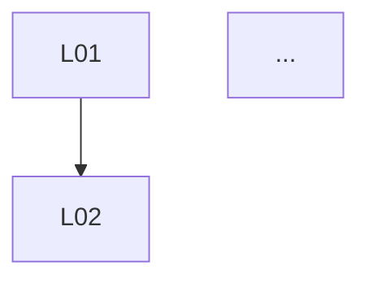

# P03 — Lemma Extraction (보조정리 추출)

## 사용 시점

- attempt가 outcome `partial-insight`/`novel-approach`로 종료되었고, 후보
  승격을 검토할 때.
- 또는 후보 작성 초기에 자연어 증명을 검증 가능한 단위로 쪼갤 때.

## 입력 변수

- `${ATTEMPT_PATH}` — 대상 attempt 폴더 경로.
- `${PROBLEM_ID}` — 표적 문제.
- `${PROOF_TEXT}` — 자연어 증명 본문.

## 사전 읽기 파일

- `${ATTEMPT_PATH}/result.md`
- `candidates/_TEMPLATE/`
- `schemas/candidate-meta.schema.yaml`

## 프롬프트 본문

```
다음 자연어 증명을 검증 가능한 보조정리들로 분해하세요.

증명 본문:
"""
${PROOF_TEXT}
"""

규칙:
1. 각 보조정리는 다음을 가져야 합니다.
   - 한 문장 진술
   - 의존하는 공리·외부 정리·앞선 보조정리 목록
   - 형식화 난이도 추정 (low/medium/high)
   - 알려진 빈틈(없으면 'none')
2. 보조정리는 의존 그래프가 닫히도록 분해하세요. 본문에서 암묵적으로 사용된
   사실은 명시 보조정리로 끌어내세요.
3. 외부 정리는 인용으로 처리(직접 보조정리화 금지). 인용 형식은
   '[Author Year, Theorem N]'.
4. 보조정리 ID는 L01부터 순차 부여. 의존이 깊은 보조정리는 더 큰 번호.
5. 마지막에 의존 그래프를 mermaid 또는 ASCII로 그리세요.

산출물은 마크다운, 6개 섹션 헤더로.
```

## 출력 형식 명세

```markdown
## 1. 보조정리 목록
### L01 — {제목}
- 진술: ...
- 의존: ...
- 난이도: low/medium/high
- 빈틈: ...
(반복)

## 2. 외부 인용 목록
- [Author Year, Theorem N]
- ...

## 3. 의존 그래프


## 4. 사용된 가정 일람
- 선택공리 사용 여부
- ...

## 5. 형식화 우선순위 추천
- 첫 번째로 형식화할 보조정리: L0X (사유)
- ...

## 6. candidate 승격 권고
- 권고 여부: yes/no
- 사유: ...
```

## 후속 작업

- 권고가 yes이면 `scripts/new-candidate.sh ${ATTEMPT_ID}` 실행.
- 보조정리 목록을 `candidates/PC-###/lemmas/` 하위 파일들로 이전.
- 첫 번째 형식화 우선순위는 P04로 진입.
