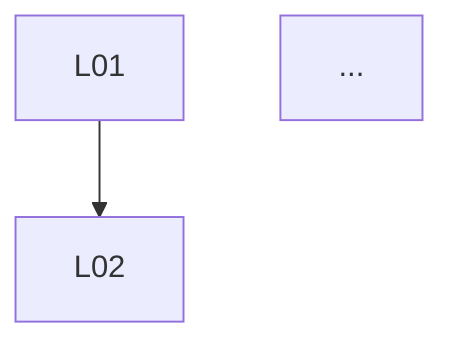

# P03 — Lemma Extraction

## When to Use

- When an attempt ends with outcome `partial-insight` /
  `novel-approach` and you are evaluating candidate promotion.
- Or when, early in candidate authoring, you split a natural-language
  proof into verifiable units.

## Input Variables

- `${ATTEMPT_PATH}` — path to the source attempt folder.
- `${PROBLEM_ID}` — target problem.
- `${PROOF_TEXT}` — body of the natural-language proof.

## Prerequisite Reading

- `${ATTEMPT_PATH}/result.md`
- `candidates/_TEMPLATE/`
- `schemas/candidate-meta.schema.yaml`

## Prompt Body

```
Decompose the following natural-language proof into verifiable lemmas.

Proof:
"""
${PROOF_TEXT}
"""

Rules:
1. Each lemma must carry:
   - A one-sentence statement.
   - A list of axioms / external theorems / preceding lemmas it depends
     on.
   - An estimated formalization difficulty (low / medium / high).
   - Known gaps (or "none").
2. Decompose so the dependency graph is closed. Surface implicit facts
   used in the body as explicit lemmas.
3. External theorems are handled as citations (do not turn them into
   lemmas). Citation format: '[Author Year, Theorem N]'.
4. Lemma IDs run from L01 upward. Deeper-dependency lemmas get larger
   numbers.
5. At the end, draw the dependency graph in mermaid or ASCII.

Produce Markdown with the six section headers below.
```

## Output Format

```markdown
## 1. Lemma list
### L01 — {title}
- Statement: ...
- Dependencies: ...
- Difficulty: low/medium/high
- Gaps: ...
(repeat)

## 2. External citations
- [Author Year, Theorem N]
- ...

## 3. Dependency graph


## 4. List of assumptions used
- Whether the axiom of choice is used
- ...

## 5. Recommended formalization priority
- First lemma to formalize: L0X (reason)
- ...

## 6. Candidate promotion recommendation
- Recommendation: yes / no
- Reason: ...
```

## Follow-ups

- If the recommendation is yes, run
  `scripts/new-candidate.sh ${ATTEMPT_ID}`.
- Migrate the lemma list into files under
  `candidates/PC-###/lemmas/`.
- Send the highest-priority lemma into P04.
